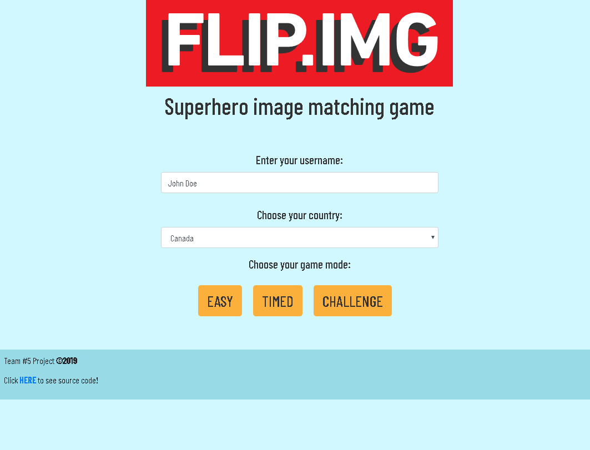
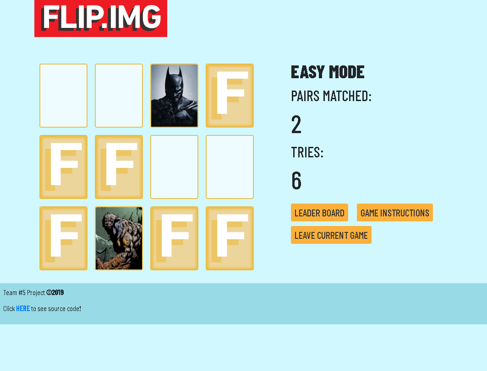
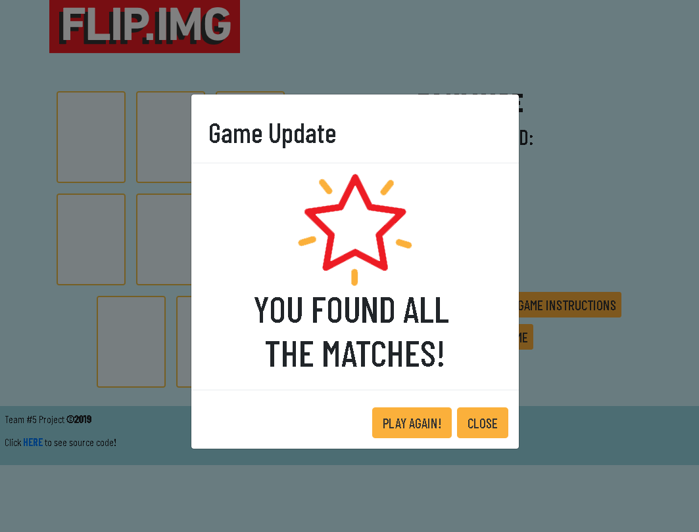
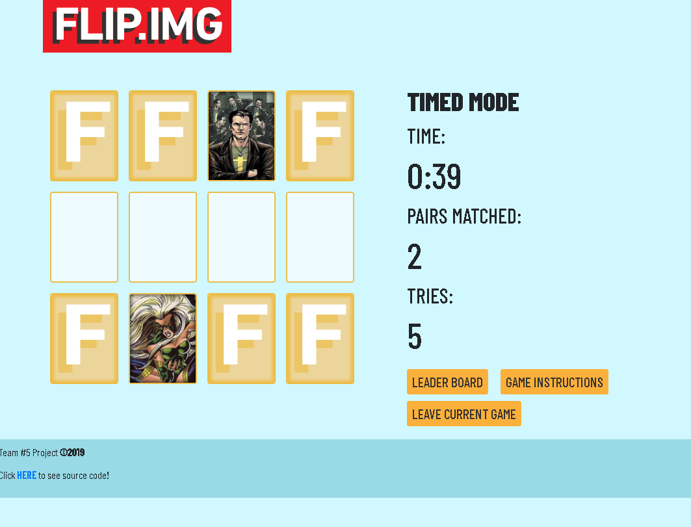
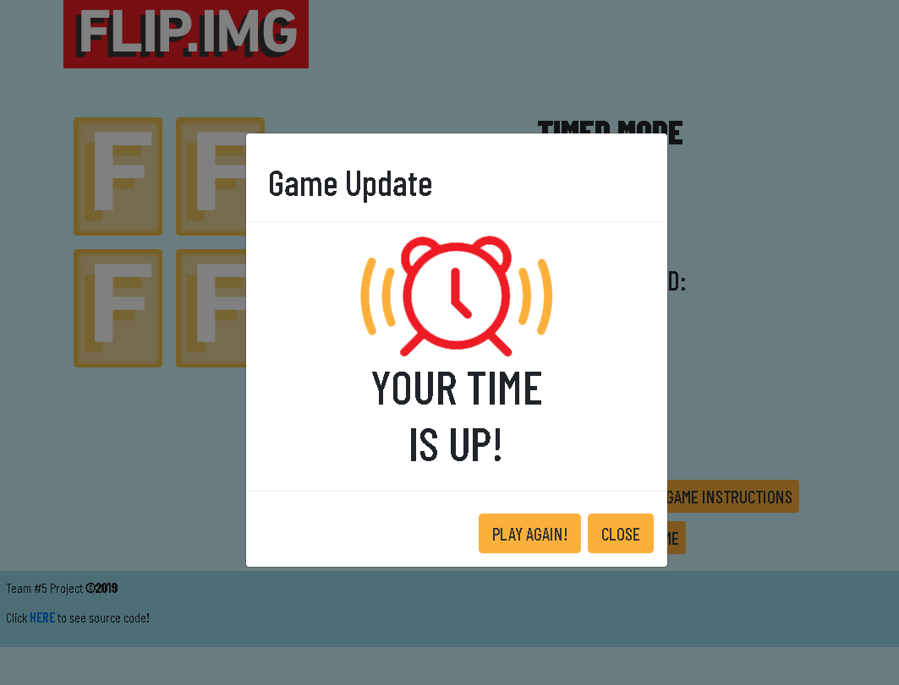
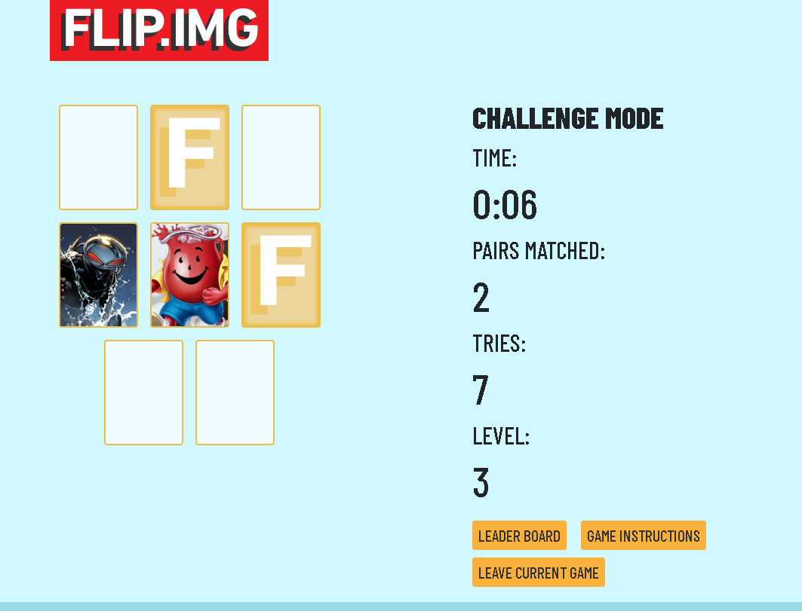
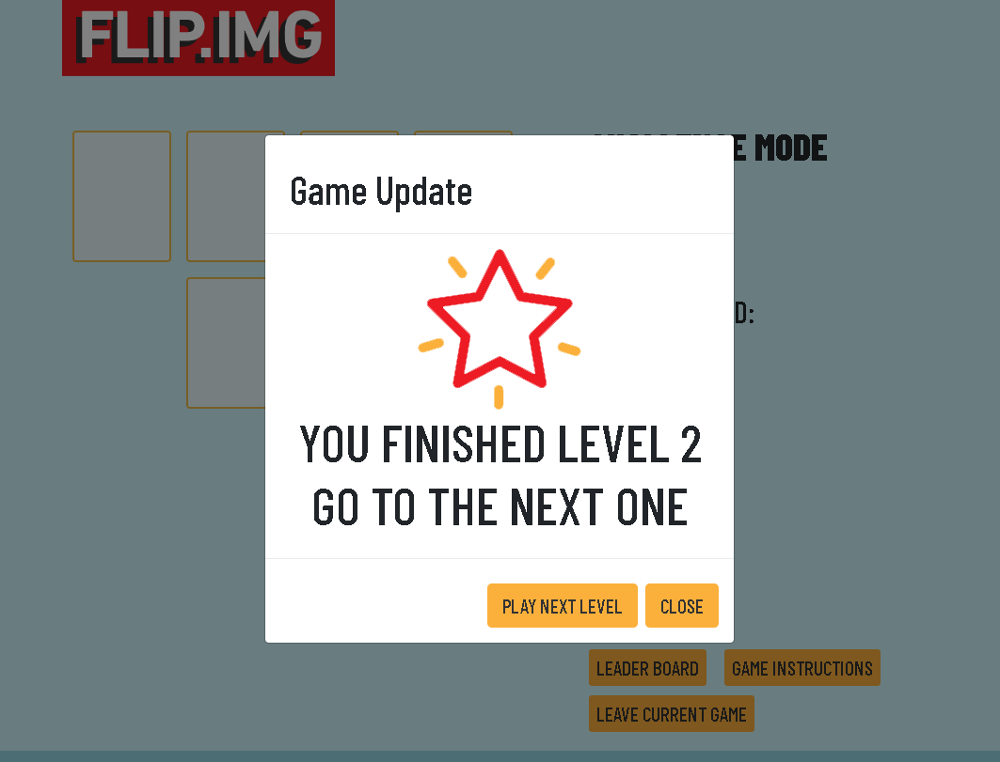
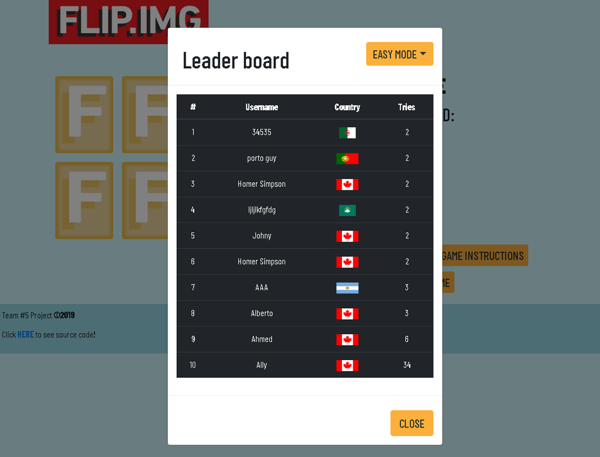

# Memory card game
## Superhero image matching game ##

See the project [live](https://juanidiaz.github.io/MemoryGame/)!

> **Cretaed by**
- Tony Green (https://github.com/AnthonyVerde)
- Alexis Sanabria (https://github.com/alexisyepes)
- Juan I Diaz (jdi@idiaz.ca)

> **Date:** January 2019

> **Project Description**

Our web version of the popular memory card game where the objective is to collect the most pairs of cards. This version will allow a player to play any of three modes: **easy** (just chose the number of pairs), **timed** (same as easy but with timed countdown) and **challenge** (a progressively difficult game). The player will also be able to log his/her game stats on a leader board using name and country.

>**Building tools**

- HTML, CSS
- Javascript and jQuery
- Bootstrap
- Google Firebase (Realtime)
- API calls using AJAX

> **APIs to be used**

- **Super Hero API** (http://superheroapi.com/) for the images on the cards.
- **REST Countries** (https://restcountries.eu/) for the flags in the leader board.

> **Sketch of product**

